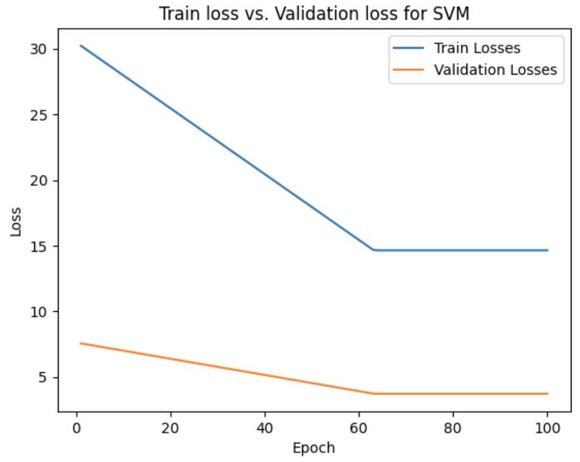
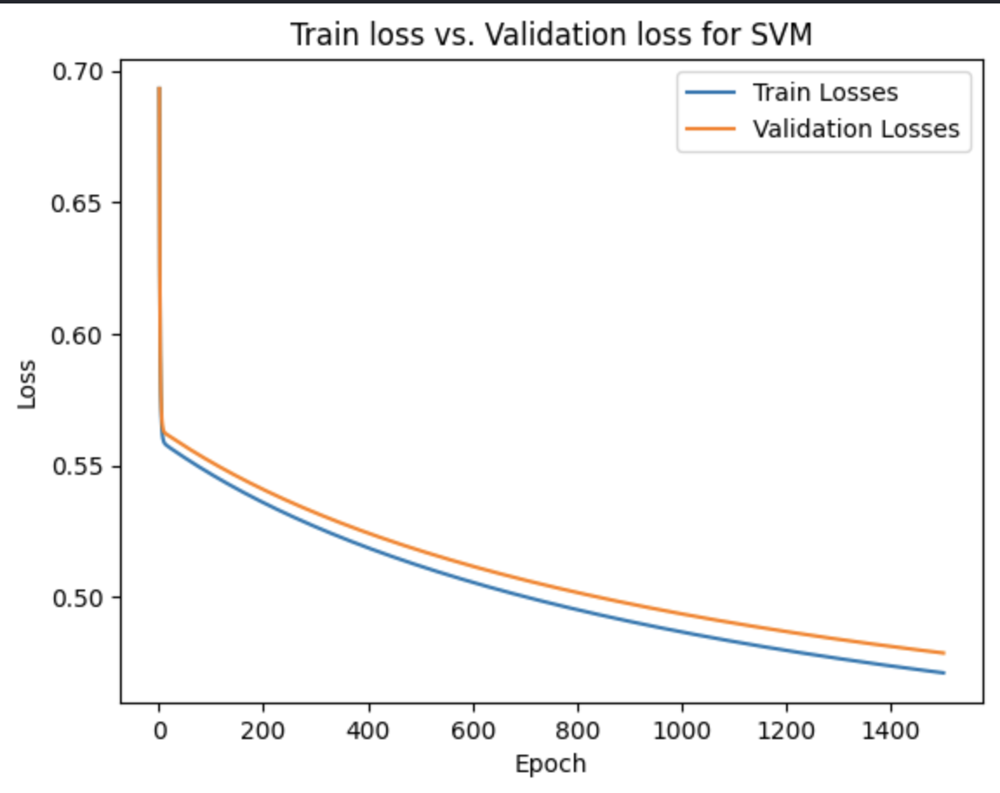

# 4AL3 FINAL PROJECT
This project focuses on building a machine learning pipeline using the UCI Adult dataset to predict whether an individual's income exceeds $50K annually. The pipeline incorporates preprocessing,
model implementation, bias measurement and bias mitigation. 

## Import and Preprocessing
The data set was first imported and cleaned by dropping unnecessary columns and handling missing values 

Then categorical features were encoded using `LabelEncoder`, and continuous features were scaled to standardize the dta

## Model Implementation

Three machine learning models were implemented and trained on the preprocessed dataset to compare performance

### Support Vector Machines (SVM)

SVM using mini-batch gradient descent and hinge loss

### Logistic Regression Model

Logsitic Regression Model using BCE loss and L2 regularization

### Random Forests Classifier

Random Forests Classifier with cross entropy loss and random sampling 

<!--  -->

## Bias Measurement 

The models are evaluated for bias across sensitive attributes such as sex and race. True Positive Rate (TPR) and False Positive Rate (FPR) are calculated for each sensitive group to identify disparities in model performance.

## Bias Mitigation

Identified biases and addressed them by applying class balancing bias mitigation strategy to ensure each class is equally represented within each sensitive group.

Models retrained using the balanced dataset and bias was re-evaluated to measure improvements.
